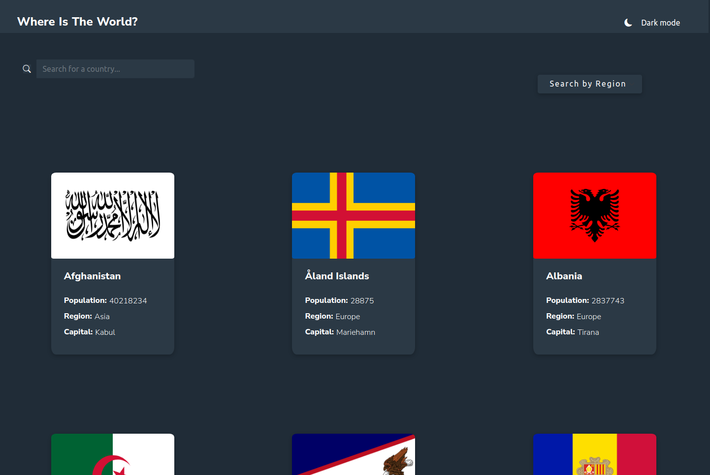

# Frontend Mentor - REST Countries API with color theme switcher solution

This is a solution to the [REST Countries API with color theme switcher challenge on Frontend Mentor](https://www.frontendmentor.io/challenges/rest-countries-api-with-color-theme-switcher-5cacc469fec04111f7b848ca). Frontend Mentor challenges help you improve your coding skills by building realistic projects.

## Table of contents  🚀

  - [Overview](#overview)
  - [The challenge](#the-challenge)
  - [Screenshot](#screenshot)
  - [Links](#links)
  - [Built with](#built-with)
  - [Author](#author)

## Overview

I really like this project because it helped me extend
my skills in responsive design .I adjasted my knowlages by creating
pages dynamically with nodejs and also  
t dark/light mode with local Storage. I really enjoyed.
I'm open for any feedback or recommendations.

### The challenge

Users should be able to:

- See all countries from the API on the homepage.
- Search for a country using an `input` field.
- Filter countries by region.
- Click on a country to see more detailed information on a separate page.
- Click through to the border countries on the detail page.
- Toggle the color scheme between light and dark mode *(optional)*.

### Screenshot

### Links

- Solution URL: [Add solution URL here](https://your-solution-url.com)
- GitHub: [Add live site URL here](https://github.com/kate-sarant/REST-Countries-API-with-color-theme-switcher)

### Built with

- Semantic HTML5 markup
- CSS custom properties
- Flexbox
- CSS Grid
- Mobile-first workflow
- JavaScript
- [Node](https://nodejs.org/) - Nodejs
- [React](https://reactjs.org/) - JS library
- Bootstrap(https://getbootstrap.com/)- Bootstrap 5

### Useful resources
During this project i visited :
- [developer.mozilla.org](https://developer.mozilla.org/en-US/docs/Web/API/Window/localStorage) - For some guiding about localStorage.
- [nodejs.org/](https://nodejs.org/en/docs/) - For some guiding about nodejs.

## Author

- Frontend Mentor - [@yourusername](https://www.frontendmentor.io/profile/kate-sarant)
- Twitter - @KateSarant (https://www.twitter.com/KateSarant)
- Linkedin - linkedin.com/in/aikaterini-sarantopoulou-4b05a51b5
- GitHub - [kate-sarant] https://github.com/kate-sarant
